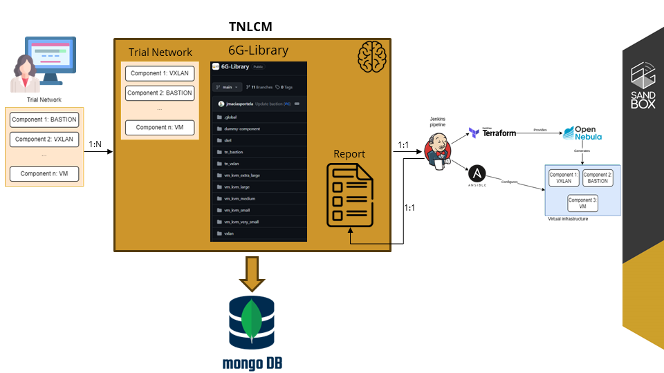

<a name="readme-top"></a>

<div align="center">

  [![Contributors][contributors-shield]][contributors-url]
  [![Forks][forks-shield]][forks-url]
  [![Stargazers][stars-shield]][stars-url]
  [![Issues][issues-shield]][issues-url]

  <a href="https://github.com/6G-SANDBOX/TNLCM"></a>

  # Trial Network Life Cycle Manager - TNLCM <!-- omit in toc -->

  [![TNLCM][tnlcm-badge]][tnlcm-url]

  [Report error](https://github.com/6G-SANDBOX/TNLCM/issues) · [Suggest something](https://github.com/6G-SANDBOX/TNLCM/issues)
</div>

TNLCM has been designed as a modular application, with the intention of making certain components easily replaceable or extended, while minimizing the effect of changes in other parts of the application. At the same time, there is an emphasis on re-usability, where several data structures and generic logic can be shared between the different components of the application.

> [!WARNING]
> TNLCM is under development and is subject to continuous changes.

<details>
<summary>Table of Contents</summary>

- [:hammer\_and\_wrench: Stack](#hammer_and_wrench-stack)
- [Branches Distribution](#branches-distribution)
- [Code Structure](#code-structure)
- [Life Cycle](#life-cycle)
- [Current Status](#current-status)
- [:rocket: Getting Started](#rocket-getting-started)
  - [Download or clone repository](#download-or-clone-repository)
  - [Create .env using .env.template](#create-env-using-envtemplate)
  - [:floppy\_disk: Create TNLCM database](#floppy_disk-create-tnlcm-database)
  - [:snake: Create Python environment and install libraries](#snake-create-python-environment-and-install-libraries)
- [How to use Swagger UI](#how-to-use-swagger-ui)
- [:pencil: Report with the results of the Trial Network deployment](#pencil-report-with-the-results-of-the-trial-network-deployment)
- [Trial Network Descriptor Schema](#trial-network-descriptor-schema)
</details>

## :hammer_and_wrench: Stack
- [![Python][python-badge]][python-url] - Programming language.
- [![Flask][flask-badge]][flask-url] - Python microframework for web applications to expose the API.
- [![MongoDB][mongodb-badge]][mongodb-url] - NoSQL database designed to store Trial Networks.
- [![Docker][docker-badge]][docker-url] - Platform for running database applications.

## Branches Distribution

The **main** branch will be updated every time there is a plenary meeting. Releases will be created from this branch.

The **dev** branch will be used for development. This branch will feed the staging and main branches.

The **staging** branch will be updated every time there is a plenary meeting or a demo.

## Code Structure

TNLCM code is structured as follows:

* **.github**: folder that contains files and templates for GitHub workflow automation.
  * **workflows**: holds GitHub workflow files, containing automated actions triggered by specific events like pull requests or commits.
  * **templates**: store templates used for creating issues or pull requests, ensuring consistency and formatting in repository communication.
* **descriptors**: folder in which trial network templates are stored.
* **docs**: folder in which all documentation is stored.
* **src**: folder in which the developed code is stored.
  * **auth**: folder in which the authentication of users who have access is handled.
  * **callback**: folder that handle the connection with Jenkins for component deployment.
  * **database**: folder that handle the creation and connection to the MongoDB database.
  * **exceptions**: folder that handle the creation of custom exceptions.
  * **logs**: folder that handle log creation.
  * **repository**: folder that handle the connection to any repository.
  * **routes**: folder that handle the API that is exposed.
  * **sixglibrary**: folder that handle the connection to the 6G-Library.
  * **temp**: folder that handle the creation of temporary files.
  * **trial_network**: folder that handle the trial networks.
  * **verification**: folder that handle the users verification to access to TNLCM.
* **tests**: folder that contains files related to testing the code.
* **app.py**: main file that starts TNLCM.
* **CHANGELOG.md**: file containing the changes made in each release.
* **config.py**: configuration file.
* **docker-compose.yml**: file for database creation.
* **requirements.txt**: file containing the libraries and their versions.

## Life Cycle



<p align="right"><a href="#readme-top">Back to top&#x1F53C;</a></p>

## Current Status

TNLCM is currently capable of deploying different types of components, which are: **tn_vxlan**, **vxlan**, **tn_bastion**, **vm_kvm**, **k8s**, **open5gs**, **UERANSIM-gNB** and **UERANSIM-UE**.


<p align="right"><a href="#readme-top">Back to top&#x1F53C;</a></p>

## :rocket: Getting Started

> [!WARNING]
> It is recommended to do this deployment on a virtual machine since you must use a callback URL that Jenkins must have access to.
> 
> The following tools are required to be deployed on platforms:

* Jenkins (Mandatory)
* OpenNebula (Mandatory)
* MinIO (Mandatory)

### Download or clone repository

Download the main branch from the TNLCM repository

Clone repository:

```bash
git clone https://github.com/6G-SANDBOX/TNLCM
```

### Create .env using .env.template

Create the .env file at the same level and with the contents of the [.env.template](../.env.template) file.

### :floppy_disk: Create TNLCM database

> This step requires Docker to be installed on the machine.

* [Windows](https://docs.docker.com/desktop/install/windows-install/)
* [Linux](https://docs.docker.com/desktop/install/linux-install/)

Once Docker is installed, open a terminal where the docker-compose.yml file is stored (usually inside the TNLCM project) and execute the commands:

```bash
docker compose build
```

Flag **-d** can be added to raise the container in background:
```bash
docker compose up -d
```

### :snake: Create Python environment and install libraries

The environment must be created inside the TNLCM project

* Windows

  ```bash
  # Create environment
  python -m venv venv

  # Activate environment
  ./venv/Scripts/activate.ps1

  # Install libraries
  pip install -r requirements.txt
  ```

* Linux

  ```bash
  # Create environment
  python3 -m venv venv

  # Activate environment
  source venv/bin/activate
  
  # Install libraries
  pip install -r requirements.txt
  ```

With the environment activated, start TNLCM

```bash
python app.py
```

A Swagger UI will be available at the url http://localhost:5000 where the API with the endpoints can be seen

<p align="right"><a href="#readme-top">Back to top&#x1F53C;</a></p>

## How to use Swagger UI

The API set forth in the TNLCM is as follows:


If it is the first time using the API it is necessary to create a user:


Once the user has been created or if it has been previously created, add the user and its password in the green **Authorize** box:


Once the user has been added, an access token and its refresh token can be generated. This access token has a duration of 45 minutes (can be modified):


The next step is to add the token in the green **Authorize** box. It is required to put the word **Bearer**, a space and then the token. An example is shown:


Now, requests that involve having an access token can be made

If the access token expires, it can be refreshed by using the refresh token. The token in the green **Authorize** box must be updated with the refresh token and the post request must be made:


<p align="right"><a href="#readme-top">Back to top&#x1F53C;</a></p>

## :pencil: Report with the results of the Trial Network deployment

The file with the report after deploying all the components in Jenkins is stored in the path **tnlcm/src/callback/reports**. By default, the reports folder is not created until the components are deployed. The file has a markdown extension and is named "current_user" + "tn_id" + ".md".

Several tools can be used to open the file:

* Extension vscode: [Markdown All in One](https://marketplace.visualstudio.com/items?itemName=yzhang.markdown-all-in-one)
* [Obsidian](https://obsidian.md/)

<p align="right"><a href="#readme-top">Back to top&#x1F53C;</a></p>

## Trial Network Descriptor Schema

> The format of Trial Network Descriptors has not been finalized and is expected to change in the future.

Trial Network Descriptors are yaml files with a set of expected fields and structure. 

```yaml
trial_network:  # Mandatory, contains the description of all entities in the Trial Network
  <Entity1>:  # A unique identifier for each entity in the Trial Network
    type:  # A type of component
    depends_on: # List of dependencies of the component with other components
      - <EntityN>
      - ...
    public: # Necessary variables collected from the public part of the 6G-Library
      ...
```

This repository contains examples of descriptor:
- [`01_descriptor.yml`](../descriptors/01_descriptor.yml)
- [`02_descriptor.yml`](../descriptors/02_descriptor.yml)

The first Trial Network end-to-end:
- [`03_descriptor.yml`](../descriptors/03_descriptor_e2e.yml)

<p align="right"><a href="#readme-top">Back to top&#x1F53C;</a></p>

<!-- Urls, Shields and Badges -->
[tnlcm-badge]: https://img.shields.io/badge/TNLCM-v0.1.0-blue
[tnlcm-url]: https://github.com/6G-SANDBOX/TNLCM/releases/tag/v0.1.0
[python-badge]: https://img.shields.io/badge/Python-3.12.2+-blue?style=for-the-badge&logo=python&logoColor=white&labelColor=3776AB
[python-url]: https://www.python.org/downloads/release/python-3122/
[flask-badge]: https://img.shields.io/badge/Flask-3.0.3+-brightgreen?style=for-the-badge&logo=flask&logoColor=white&labelColor=000000
[flask-url]: https://flask.palletsprojects.com/en/3.0.x/
[mongodb-badge]: https://img.shields.io/badge/MongoDB-latest-green?style=for-the-badge&logo=mongodb&logoColor=white&labelColor=47A248
[mongodb-url]: https://www.mongodb.com/
[docker-badge]: https://img.shields.io/badge/Docker-latest-6AB7FF?style=for-the-badge&logo=docker&logoColor=white&labelColor=2496ED
[docker-url]: https://www.docker.com
[contributors-shield]: https://img.shields.io/github/contributors/6G-SANDBOX/TNLCM.svg?style=for-the-badge
[contributors-url]: https://github.com/6G-SANDBOX/TNLCM/graphs/contributors
[forks-shield]: https://img.shields.io/github/forks/6G-SANDBOX/TNLCM.svg?style=for-the-badge
[forks-url]: https://github.com/6G-SANDBOX/TNLCM/network/members
[stars-shield]: https://img.shields.io/github/stars/6G-SANDBOX/TNLCM.svg?style=for-the-badge
[stars-url]: https://github.com/6G-SANDBOX/TNLCM/stargazers
[issues-shield]: https://img.shields.io/github/issues/6G-SANDBOX/TNLCM.svg?style=for-the-badge
[issues-url]: https://github.com/6G-SANDBOX/TNLCM/issues