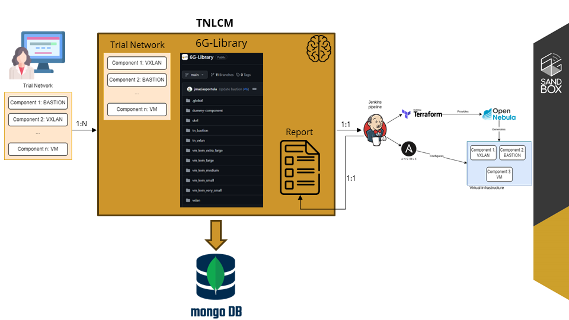
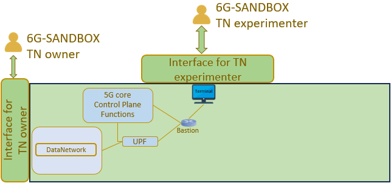
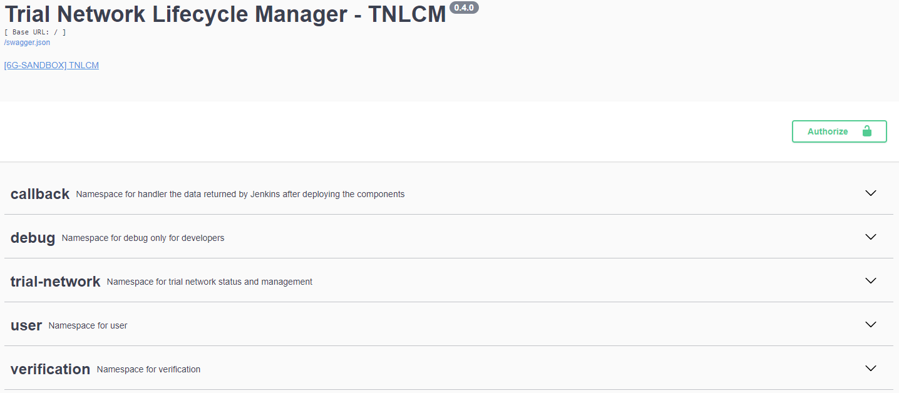
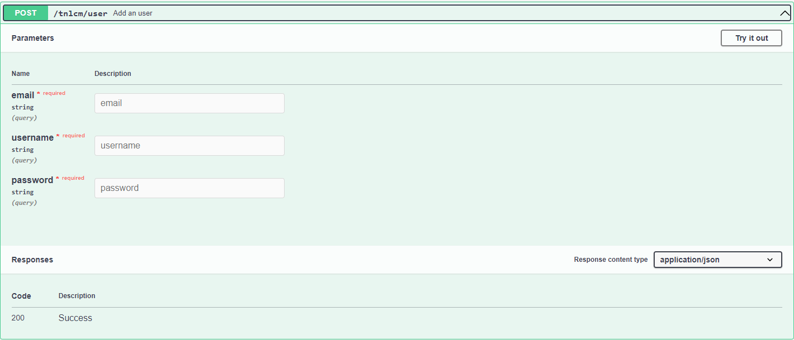
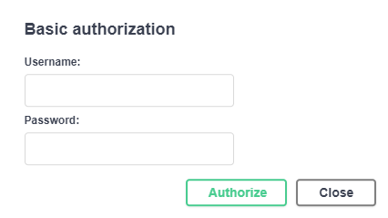
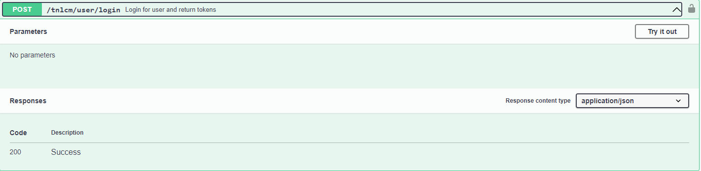
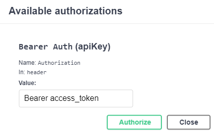
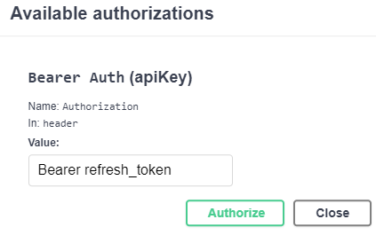
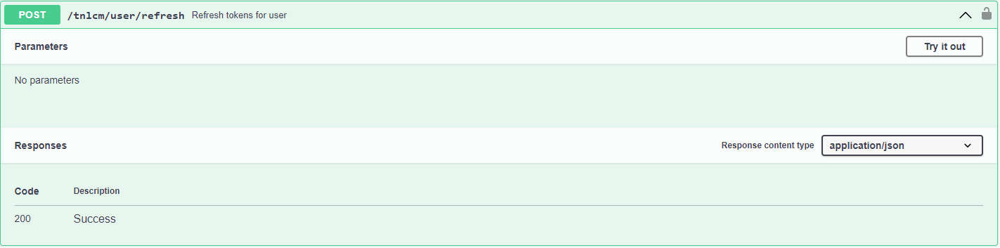

# TRIAL NETWORK LIFECYCLE MANAGER (TNLCM) <!-- omit in toc -->

[](https://www.python.org/downloads/release/python-3122/)
[](https://flask.palletsprojects.com/en/3.0.x/)
[](https://www.docker.com)
[](https://www.mongodb.com/)

> ⚠ TNLCM is under development and is subject to continuous changes.

## Table of contents <!-- omit in toc -->
- [Code structure](#code-structure)
- [Lifecycle](#lifecycle)
- [Current Architecture](#current-architecture)
- [Deploy TNLCM](#deploy-tnlcm)
  - [Download or clone repository](#download-or-clone-repository)
  - [Create .env using .env.template](#create-env-using-envtemplate)
  - [Create TNLCM database](#create-tnlcm-database)
  - [Create Python environment and install libraries](#create-python-environment-and-install-libraries)
  - [Start TNLCM](#start-tnlcm)
- [How to use Swagger UI](#how-to-use-swagger-ui)
- [Report with the results of the Trial Network deployment](#report-with-the-results-of-the-trial-network-deployment)
- [Trial Network Descriptor Schema](#trial-network-descriptor-schema)

## Code structure

TNLCM code is structured as follows:

* **docs**: folder in which all documentation is stored.
* **src**: folder in which the developed code is stored.
  * **auth**: folder in which the authentication of users who have access is handled.
  * **callback**: folder that handle the connection with Jenkins for component deployment.
  * **database**: folder that handle the creation and connection to the MongoDB database.
  * **exceptions**: folder that handle the creation of custom exceptions.
  * **logs**: folder that handle log creation.
  * **repository**: folder that handle the connection to any repository.
  * **routes**: folder that handle the API that is exposed.
  * **sixglibrary**: folder that handle the connection to the 6G-Library.
  * **temp**: folder that handle the creation of temporary files.
  * **trial_network**: folder that handle the trial networks.

* **app.py**: main file that starts TNLCM.
* **CHANGELOG.md**: file containing the changes made in each release.
* **config.py**: configuration file.
* **docker-compose.yml**: file for database creation.
* **requirements.txt**: file containing the libraries and their versions.

## Lifecycle



## Current Architecture

TNLCM is currently capable of deploying three types of components which are **tn_vxlan**, **tn_bastion** and **vm_kvm**.



## Deploy TNLCM

> ⚠ It is recommended to do this deployment on a virtual machine since you must use a callback URL that Jenkins must have access to.

> ⚠ The following tools are required to be deployed on platforms:

* Jenkins (Mandatory)
* OpenNebula (Mandatory)
* MinIO (Optional)

### Download or clone repository

Download the main branch from the TNLCM repository

Clone repository:

```
git clone https://github.com/6G-SANDBOX/TNLCM
```

### Create .env using .env.template

Create the .env file at the same level and with the contents of the [.env.template](../.env.template) file.

### Create TNLCM database

> This step requires Docker to be installed on the machine.

* [Windows](https://docs.docker.com/desktop/install/windows-install/)
* [Linux](https://docs.docker.com/desktop/install/linux-install/)

Once Docker is installed, open a terminal where the docker-compose.yml file is stored (usually inside the TNLCM project) and execute the commands:

```
docker compose build

docker compose up
```

### Create Python environment and install libraries

The environment must be created inside the TNLCM project

* Windows

        # Create environment
        python -m venv venv

        # Activate environment
        ./venv/Scripts/activate.ps1

        # Install libraries
        pip install -r requirements.txt

* Linux

        # Create environment
        python3 -m venv venv

        # Activate environment
        source venv/bin/activate
        
        # Install libraries
        pip install -r requirements.txt

### Start TNLCM

With the environment activated, start TNLCM

```
python app.py
```

A Swagger UI will be available at the url http://localhost:5000 where the API with the endpoints can be seen

## How to use Swagger UI

The API set forth in the TNLCM is as follows:



If it is the first time using the API it is necessary to create a user:



Once the user has been created or if it has been previously created, add the user and its password in the green **Authorize** box:



Once the user has been added, an access token and its refresh token can be generated. This access token has a duration of 45 minutes (can be modified):



The next step is to add the token in the green **Authorize** box. It is required to put the word **Bearer**, a space and then the token. An example is shown:



Now, requests that involve having an access token can be made

If the access token expires, it can be refreshed by using the refresh token. The token in the green **Authorize** box must be updated with the refresh token and the post request must be made:





## Report with the results of the Trial Network deployment

The file with the report after deploying all the components in Jenkins is stored in the path **tnlcm/src/callback/reports**. By default, the reports folder is not created until the components are deployed. The file has a markdown extension and is named "current_user" + "tn_id" + ".md".

Several tools can be used to open the file:

* Extension vscode: [Markdown All in One](https://marketplace.visualstudio.com/items?itemName=yzhang.markdown-all-in-one)
* [Obsidian](https://obsidian.md/)

## Trial Network Descriptor Schema

> The format of Trial Network Descriptors has not been finalized and is expected to change in the future.

Trial Network Descriptors are yaml files with a set of expected fields and structure. This repository contains an example of descriptor:
- [`first_descriptor.yml`](../first_descriptor.yml)

```yaml
trial_network:  # Mandatory, contains the description of all entities in the Trial Network
  <Entity1>:  # A unique identifier for each entity in the Trial Network
    type:  # A type of component
    depends_on: # List of dependencies of the component with other components
      - <EntityN>
      - ...
    public: # Necessary variables collected from the public part of the 6G-Library
      ...
```