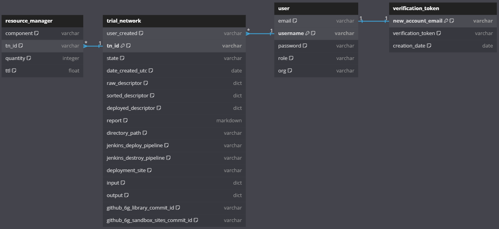

<a name="readme-top"></a>

<div align="center">

  [![Contributors][contributors-shield]][contributors-url]
  [![Forks][forks-shield]][forks-url]
  [![Stargazers][stars-shield]][stars-url]
  [![Issues][issues-shield]][issues-url]
  <!-- [![MIT License][license-shield]][license-url] -->
  <!-- [![LinkedIn][linkedin-shield]][linkedin-url] -->

  <a href="https://github.com/6G-SANDBOX/TNLCM"></a>

  [![TNLCM][tnlcm-badge]][tnlcm-url]

  [Report error](https://github.com/6G-SANDBOX/TNLCM/issues/new?assignees=&labels=&projects=&template=bug_report.md) · [Feature request](https://github.com/6G-SANDBOX/TNLCM/issues/new?assignees=&labels=&projects=&template=feature_request.md)
</div>

TNLCM has been designed as a modular application, with the intention of making certain components easily replaceable or extended, while minimizing the effect of changes in other parts of the application. At the same time, there is an emphasis on re-usability, where several data structures and generic logic can be shared between the different components of the application.

<details>
<summary>Table of Contents</summary>

- [:hammer\_and\_wrench: Stack](#hammer_and_wrench-stack)
- [:open\_file\_folder: Project Structure](#open_file_folder-project-structure)
- [:mag: Overview of TNLCM and 6G-Library implementation](#mag-overview-of-tnlcm-and-6g-library-implementation)
- [:arrows\_counterclockwise: State Machine](#arrows_counterclockwise-state-machine)
- [:rocket: Getting Started Locally](#rocket-getting-started-locally)
  - [:inbox\_tray: Download the installation script](#inbox_tray-download-the-installation-script)
  - [:gear: Configure environment variables](#gear-configure-environment-variables)
  - [:desktop\_computer: Execute installation script](#desktop_computer-execute-installation-script)
  - [:snake: Start server](#snake-start-server)
- [:page\_facing\_up: Trial Network Descriptor Schema](#page_facing_up-trial-network-descriptor-schema)
- [:paperclip: Appendices](#paperclip-appendices)
  - [Appendix A: How to use Swagger UI](#appendix-a-how-to-use-swagger-ui)
  - [Appendix B: Database Schema](#appendix-b-database-schema)
  - [Appendix C: TNLCM OpenNebula Appliance](#appendix-c-tnlcm-opennebula-appliance)
</details>

## :hammer_and_wrench: Stack
- [![Python][python-badge]][python-url] - Programming language.
- [![Flask][flask-badge]][flask-url] - Python framework for web applications to expose the API.
- [![MongoDB][mongodb-badge]][mongodb-url] - NoSQL database designed to store Trial Networks.

## :open_file_folder: Project Structure

```
TNLCM/                       // main folder.
├─ .github/                  // folder contains files and templates for GitHub workflow automation.
├─ conf/                     // folder that handler the configuration files.
├─ core/                     // folder that the developed code is stored.
│  ├─ auth/                  // folder that handler the authentication of users who have access.
│  ├─ callback/              // folder that handler the callback received by Jenkins.
│  ├─ cli/                   // folder that handler the cli for run commands.
│  ├─ database/              // folder that handler the connection with MongoDB database using mongoengine.
│  ├─ exceptions/            // folder that handler the creation of custom exceptions.
│  ├─ jenkins/               // folder that handler the connection with Jenkins for tn deployment.
│  ├─ logs/                  // folder that handler the logs configuration.
│  ├─ mail/                  // folder that handler the configuration to use flask mail library.
│  ├─ models/                // folder that contains the database models.
│  ├─ repository/            // folder that handler the connection to any repository.
│  ├─ routes/                // folder that handler the API that is exposed.
│  ├─ sixg_library/          // folder that handler the connection to the 6G-Library repository.
│  ├─ sixg_sandbox_sites/    // folder that handler the connection to the 6G-Sandbox-Sites repository.
│  ├─ temp/                  // folder that handler the creation of temporary files.
│  └─ utils/                 // folder that handler data conversions and storage in YAML, Markdown, and JSON formats.
├─ docker/                   // folder containing Docker-related configuration and setup files.
├─ docs/                     // folder where all documentation is stored.
├─ scripts/                  // folder contains scripts for automated deployments.
│  ├─ deploy_vm.sh           // file to deploy TNLCM with its dependencies on a vm.
│  └─ deploy_docker.sh       // file to deploy TNLCM in docker with its dependencies.
├─ tn_template_lib/          // folder that trial network descriptors templates are stored.
├─ .dockerignore             // file specifying which files and directories to ignore in the Docker build context.
├─ .env.template             // file that contains placeholder environment variables for configuring the application.
├─ .gitignore                // file specifying intentionally untracked files to ignore.
├─ app.py                    // main file that starts TNLCM.
├─ CHANGELOG.md              // file containing the changes made in each release.
├─ docker-compose.yaml       // file for create database.
└─ requirements.txt          // file containing the libraries and their versions.
```

## :mag: Overview of TNLCM and 6G-Library implementation


<p align="right"><a href="#readme-top">Back to top&#x1F53C;</a></p>

## :arrows_counterclockwise: State Machine

TNLCM is a **state machine** that allows the automation of component deployment. <span style="color: green;">Green</span> indicates what is implemented and <span style="color: red;">red</span> indicates what is in the process of implementation.

### States <!-- omit in toc -->

- **Validated**: trial network descriptor created is checked to see if it can be deployed. 6G-Library is used to validate it
- **Activated**: trial network has been deployed in OpenNebula
- **Suspended**: trial network has been suspended. It remains deployed, but turned off
- **Failed**: there was an error during the trial network deployment
- **Destroyed**: trial network deployment in OpenNebula is removed, but its content is kept in the database and locally
- **Purge**: the trial network and the callbacks are removed from the database as well as its local content

### Transitions <!-- omit in toc -->

- Initial state &rarr; Validated: trial network descriptor validated and ready for deploy
- Validated &rarr; Activated: trial network deployed and ready for use
- Validated &rarr; Failed: trial network deployment failed
- Validated &rarr; Purge: trial network invalid
- Failed &rarr; Failed: again, trial network deployment failed
- Activated &rarr; Destroyed: trial network destroyed and ready for deploy again
- Activated &rarr; Suspended: TODO
- Suspended &rarr; Activated: TODO
- Destroyed &rarr; Activated: trial network deployed and ready for use 
- Destroyed &rarr; Purge: trial network removed


<p align="right"><a href="#readme-top">Back to top&#x1F53C;</a></p>

## :rocket: Getting Started Locally

> [!NOTE]
> TNLCM is being developed and tested on Ubuntu in version 24.04 LTS.

> [!IMPORTANT]
> TNLCM requires the prior installation of:
> 
> | Repository       | Release                                                                                |
> | ---------------- | -------------------------------------------------------------------------------------- |
> | OpenNebula       | [v6.10](https://github.com/OpenNebula/one/releases/tag/release-6.10.0)                 |
> | Jenkins          | [v2.462.3](https://github.com/jenkinsci/jenkins/releases/tag/jenkins-2.462.3)          |
> | MinIO            | [2024-07-04](https://github.com/minio/minio/releases/tag/RELEASE.2024-07-04T14-25-45Z) |

> [!TIP]
> Additionally, TNLCM depends on:
>
> | Repository       | Branch                                                        | Release                                                                   |
> | ---------------- | ------------------------------------------------------------- | ------------------------------------------------------------------------- |
> | 6G-Library       | -                                                             | [v0.3.0](https://github.com/6G-SANDBOX/6G-Library/releases/tag/v0.3.0)    |
> | 6G-Sandbox-Sites | [platform](https://github.com/6G-SANDBOX/6G-Sandbox-Sites)    | -                                                                         |

### :inbox_tray: Download the installation script

Download the installation script which is [`deploy_vm.sh`](../scripts/deploy_vm.sh) and is located in the `scripts` folder.

### :gear: Configure environment variables

Update the script and add the contents of the following variables:

> [!IMPORTANT]
> There is a comment **TODO** in the script.

- `TNLCM_ADMIN_USER`
- `TNLCM_ADMIN_PASSWORD`
- `TNLCM_HOST`
- `JENKINS_HOST`
- `JENKINS_USERNAME`
- `JENKINS_PASSWORD`
- `JENKINS_TOKEN`
- `SITES_TOKEN`

### :desktop_computer: Execute installation script

> [!NOTE]  
> Execute the script with the **root** user.

Once the environment variables have been filled in, run the script:

```bash
chmod 777 deploy_vm.sh
```

```bash
./deploy_vm.sh
```

A MongoDB dashboard will be available at the url http://mongo-express-ip:8081 where the database can be managed.

> [!NOTE]
> User and password to access to the MongoDB dashboard are the values indicated in the variables `ME_CONFIG_BASICAUTH_USERNAME` and `ME_CONFIG_BASICAUTH_PASSWORD` of the `.env` file. By default, the values indicated in the [`.env.template`](../.env.template) file are used.


### :snake: Start server

```bash
gunicorn -c conf/gunicorn_conf.py
```

A Swagger UI will be available at the url http://tnlcm-backend-ip:5000 where the API with the endpoints can be seen.

<p align="right"><a href="#readme-top">Back to top&#x1F53C;</a></p>

## :page_facing_up: Trial Network Descriptor Schema

> [!WARNING]
> The format of Trial Network Descriptors has not been finalized and is expected to change in the future.

Trial Network Descriptors are yaml files with a set of expected fields and with the following structure:

```yaml
trial_network: # Mandatory, contains the description of all entities in the Trial Network
  type-name: # Mandatory, entity name. Unique identifier for each entity in the Trial Network
    type: # Mandatory, 6G-Library component type
    name: # Mandatory, custom name. Not use character \- or \. Exclude components tn_init, tn_bastion and tn_vxlan
    debug: # Optional, param to debug component in Jenkins. Possible values true or false
    dependencies: # Mandatory, list of dependencies of the component with other components
      - type-name
      - ...
    input: # Mandatory, dictionary with the variables collected from the input part of the 6G-Library
      key: value
```

This repository contains a variety of [descriptors](../tn_template_lib/). Access the [documentation](./TRIAL_NETWORKS.md) to see what is defined in each of them.

- [`08_descriptor.yaml`](../tn_template_lib/08_descriptor.yaml) - **should work on all platforms**. First end-to-end trial network.
- [`referente_tn.yaml`](../tn_template_lib/reference_tn.yaml) - **should work on all platforms**. Reference trial network defined in WP5.

<p align="right"><a href="#readme-top">Back to top&#x1F53C;</a></p>

## :paperclip: Appendices

### Appendix A: How to use Swagger UI

The API set forth in the TNLCM is as follows:


If it is the first time using the API it is necessary to create a user. A verification code is required, so it is necessary to enter a valid email address that can be accessed:


Once the registration code is obtained, proceed to the user registration using the email and the code previously employed:


Once the user has been created or if it has been previously created, add the user and its password in the green **Authorize** box:


Once the user has been added, an access token and its refresh token can be generated. This access token has a duration of 45 minutes (can be modified):


The next step is to add the token in the green **Authorize** box. It is required to put the word **Bearer**, a space and then the token. An example is shown:


Now, requests that involve having an access token can be made.

To create a Trial Network, the following endpoint must be used:


Once created, it will return a tn_id that will be required to deploy it.

To deploy a trial network, the following endpoint must be used:


If the access token expires, it can be refreshed by using the refresh token. The token in the green **Authorize** box must be updated with the refresh token and the post request must be made:


When the request is made, it will return another access token that will need to be put back into the green **Authorize** box.

<p align="right"><a href="#readme-top">Back to top&#x1F53C;</a></p>

### Appendix B: Database Schema

TNLCM database, created with MongoDB, consists of several collections that store important information about `resource manager`, `trial network`, `user`, and `verification token`. Below is a description of each collection, along with a graphical representation using SQL syntax created with [dbdiagram.io](https://dbdiagram.io/).

#### Collection `resource_manager` <!-- omit in toc -->

| Field       | Type    | Description                                       |
| ----------- | ------- | ------------------------------------------------- |
| `component` | string  | Component over which resources are controlled     |
| `tn_id`     | string  | ID of the trial network                           |
| `quantity`  | integer | Amount of component available                     |
| `ttl`       | float   | Time the component can be used in a trial network |

#### Collection `trial_network` <!-- omit in toc -->

| Field                               | Type     | Description                                |
| ----------------------------------- | -------- | ------------------------------------------ |
| `user_created`                      | string   | User that created the trial network        |
| `tn_id`                             | string   | ID of the trial network (primary key)      |
| `state`                             | string   | State of the trial network                 |
| `date_created_utc`                  | date     | Creation date and time in UTC              |
| `raw_descriptor`                    | dict     | Raw descriptor of the trial network        |
| `sorted_descriptor`                 | dict     | Sorted descriptor                          |
| `deployed_descriptor`               | dict     | Current status of descriptor               |
| `report`                            | markdown | Report related to the trial network        |
| `directory_path`                    | string   | Directory where trial network is saved     |
| `jenkins_deploy_pipeline`           | string   | Pipeline for descriptor deployment         |
| `jenkins_destroy_pipeline`          | string   | Pipeline for destroying trial network      |
| `deployment_site`                   | string   | Deployment site of trial network           |
| `input`                             | dict     | YAML files per entity-name sent to Jenkins |
| `output`                            | dict     | JSON received by Jenkins per entity-name   |
| `github_6g_library_commit_id`       | string   | 6G-Library commit ID                       |
| `github_6g_sandbox_sites_commit_id` | string   | 6G-Sandbox-Sites commit ID                 |

#### Collection `user` <!-- omit in toc -->

| Field      | Type   | Description                   |
| ---------- | ------ | ----------------------------- |
| `email`    | string | User's email address          |
| `username` | string | User's username (primary key) |
| `password` | string | User's hashed password        |
| `role`     | string | User's role                   |
| `org`      | string | User's organization           |

#### Collection `verification_token` <!-- omit in toc -->

| Field                | Type   | Description                             |
| -------------------- | ------ | --------------------------------------- |
| `new_account_email`  | string | Email for the new account (primary key) |
| `verification_token` | string | Verification token for the account      |
| `creation_date`      | date   | Creation date of the verification token |

#### Relationships <!-- omit in toc -->

- `resource_manager.tn_id > trial_network.tn_id` // resource_manager references trial_network
- `trial_network.user_created > user.username` // A user can have multiple trial_networks (one-to-many)
- `verification_token.new_account_email - user.email` // One-to-one relationship between verification_token and user

#### Model <!-- omit in toc -->



<p align="right"><a href="#readme-top">Back to top&#x1F53C;</a></p>

### Appendix C: TNLCM OpenNebula Appliance

In the [marketplace-community](https://github.com/6G-SANDBOX/marketplace-community/wiki/tnlcm) repository, which is a fork of OpenNebula, detailed information about the TNLCM appliance can be found. 

To deploy 6G-SANDBOX TOOLKIT in OpenNebula, the documentation can be accessed from the [web site](https://6g-sandbox.eu/wp-content/uploads/2024/09/6G-SANDBOX-Toolkit_Installation-G-V1.0_F.pdf).

<p align="right"><a href="#readme-top">Back to top&#x1F53C;</a></p>

## Contributors <!-- omit in toc -->

<a href="https://github.com/6G-SANDBOX/TNLCM/graphs/contributors">
  
</a>

<!-- Urls, Shields and Badges -->
[tnlcm-badge]: https://img.shields.io/badge/TNLCM-v0.4.2-blue
[tnlcm-url]: https://github.com/6G-SANDBOX/TNLCM/releases/tag/v0.4.2
[python-badge]: https://img.shields.io/badge/Python-3.13.0-blue?style=for-the-badge&logo=python&logoColor=white&labelColor=3776AB
[python-url]: https://www.python.org/downloads/release/python-3130/
[flask-badge]: https://img.shields.io/badge/Flask-3.0.3-brightgreen?style=for-the-badge&logo=flask&logoColor=white&labelColor=000000
[flask-url]: https://flask.palletsprojects.com/en/3.0.x/
[mongodb-badge]: https://img.shields.io/badge/MongoDB-8.0-green?style=for-the-badge&logo=mongodb&logoColor=white&labelColor=47A248
[mongodb-url]: https://www.mongodb.com/
[contributors-shield]: https://img.shields.io/github/contributors/6G-SANDBOX/TNLCM.svg?style=for-the-badge
[contributors-url]: https://github.com/6G-SANDBOX/TNLCM/graphs/contributors
[forks-shield]: https://img.shields.io/github/forks/6G-SANDBOX/TNLCM.svg?style=for-the-badge
[forks-url]: https://github.com/6G-SANDBOX/TNLCM/network/members
[stars-shield]: https://img.shields.io/github/stars/6G-SANDBOX/TNLCM.svg?style=for-the-badge
[stars-url]: https://github.com/6G-SANDBOX/TNLCM/stargazers
[issues-shield]: https://img.shields.io/github/issues/6G-SANDBOX/TNLCM.svg?style=for-the-badge
[issues-url]: https://github.com/6G-SANDBOX/TNLCM/issues
[linkedin-shield]: https://img.shields.io/badge/-LinkedIn-black.svg?style=for-the-badge&logo=linkedin&colorB=555
[linkedin-url]: https://
[license-shield]: https://img.shields.io/badge/license-CC%20BY%204.0-black.svg?style=for-the-badge
[license-url]: https://