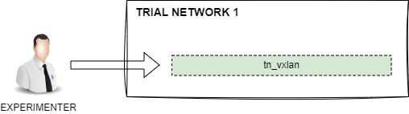
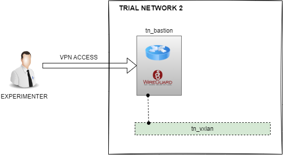
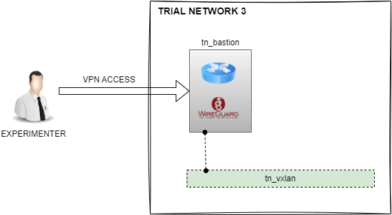
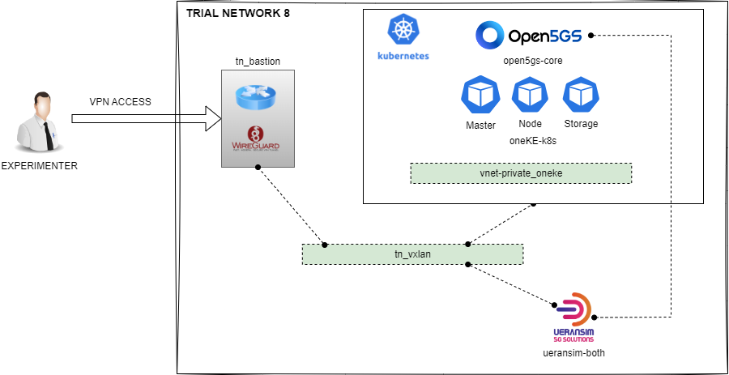
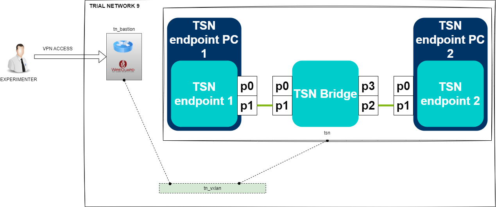
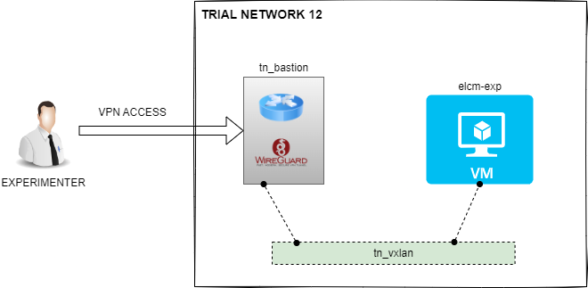
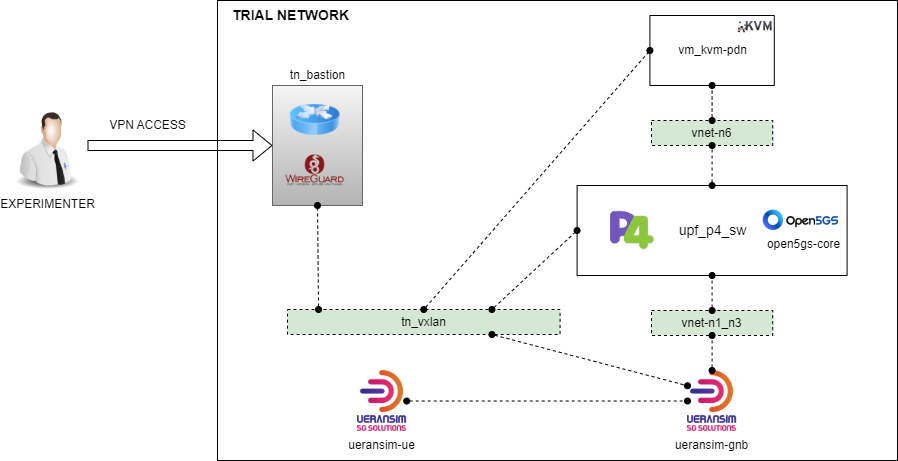
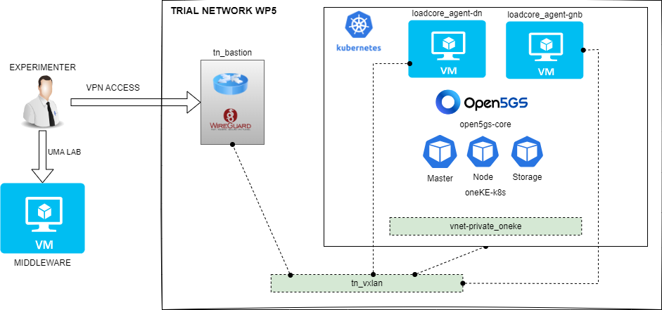
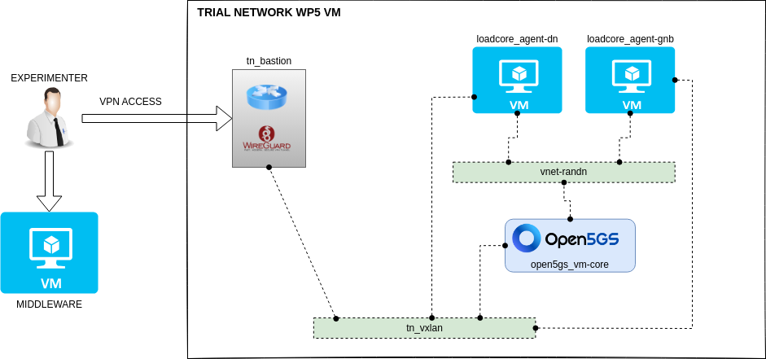
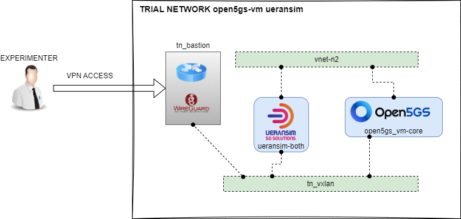

# TRIAL NETWORKS

## [tn_vxlan](./tn_vxlan.yaml)

### Components

* tn_vxlan

### Platforms

* uma
* athens
* berlin
* oulu

## [tn_bastion](./tn_bastion.yaml)

### Components

* tn_vxlan
* tn_bastion

### Platforms

* uma
* athens
* berlin
* oulu

## [tn_init](./tn_init.yaml)

### Components

* tn_init

### Platforms

* uma
* athens
* berlin
* oulu

## [vm_kvm](./vm_kvm.yaml)

### Components

* tn_init
* vm_kvm

### Platforms

* uma
* athens
* berlin
* oulu

## [oneKE](./oneKE.yaml)

### Components

* tn_init
* vnet
* oneKE

### Platforms

* uma
* athens
* berlin
* oulu

## [open5gs_oneKE](./open5gs_oneKE.yaml)

### Components

* tn_init
* vnet
* oneKE
* open5gs

### Platforms

* uma
* athens
* berlin
* oulu

## [ueransim_split](./ueransim_split.yaml)

### Components

* tn_init
* vnet
* oneKE
* open5gs
* ueransim (gnb and ue separated)

### Platforms

* uma
* athens
* berlin
* oulu

## [ueransim_both](./ueransim_both.yaml)

### Components

* tn_init
* vnet
* oneKE
* open5gs
* ueransim (all in one)

### Platforms

* uma
* athens
* berlin
* oulu

## [tsn](./tsn.yaml)

### Components

* tn_init
* tsn

### Platforms

* uma

## [nokia_radio](./nokia_radio.yaml)

### Components

* tn_init
* vnet
* oneKE
* open5gs
* nokia_radio
* stf_ue

### Platforms

* uma

## [ocf](./ocf.yaml)

### Components

* tn_init
* vnet
* oneKE
* ocf (OpenCAPIF)

### Platforms

* uma
* athens
* berlin
* oulu

## [elcm](./elcm.yaml)

### Components

* tn_init
* elcm

### Platforms

* uma
* athens
* berlin
* oulu

## [upf_p4_sw](./upf_p4_sw.yaml)

### Components

* tn_init
* vnet
* upf_p4_sw
* ueransim (gnb and ue separated)
* vm_kvm

### Platforms

* uma
* athens
* berlin
* oulu

## [int_p4_sw](./int_p4_sw.yaml)

### Components

* tn_init
* vnet
* int_p4_sw
* vm_kvm

### Platforms

* uma
* athens
* berlin
* oulu

## [loadcore_open5gs_oneKE](loadcore_open5gs_oneKE.yaml)

### Components

* tn_init
* vnet
* oneKE
* open5gs
* loadcore_agent

### Platforms

* uma
* athens
* berlin
* oulu

## [loadcore_open5gs_vm](loadcore_open5gs_vm.yaml)

### Components

* tn_init
* vnet
* open5gs_vm
* loadcore_agent

### Platforms

* berlin
* uma
* athens
* oulu

## [open5gs_vm_ueransim_both](./open5gs_vm_ueransim_both.yaml)

### Components

* tn_init
* vnet
* open5gs_vm
* ueransim (all in one)

### Platforms

* berlin
* uma
* athens
* oulu