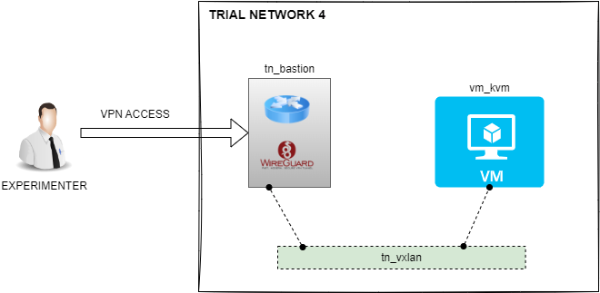
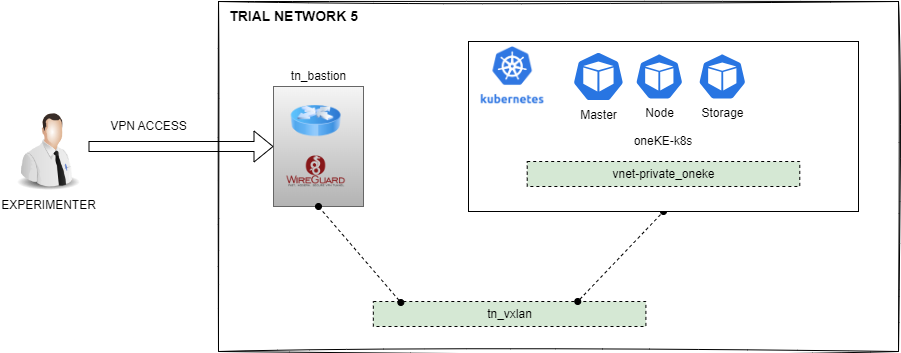
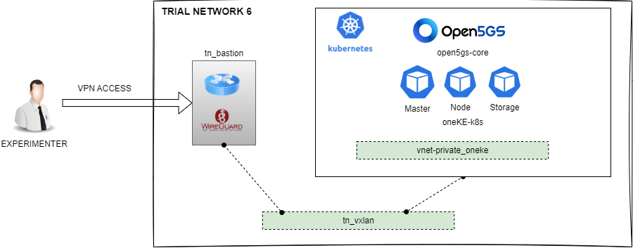
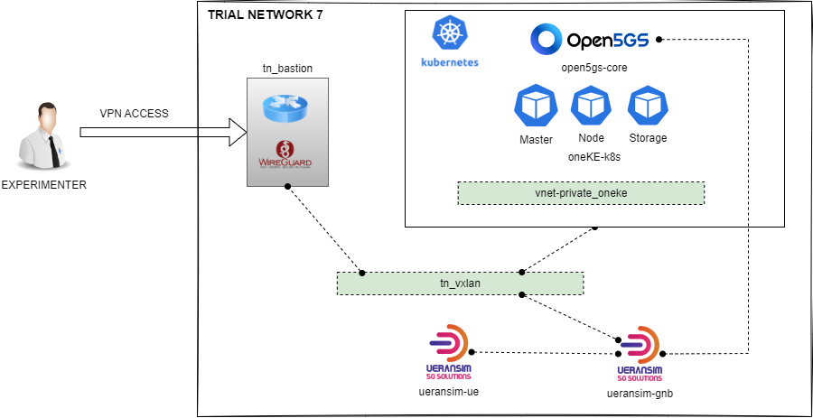
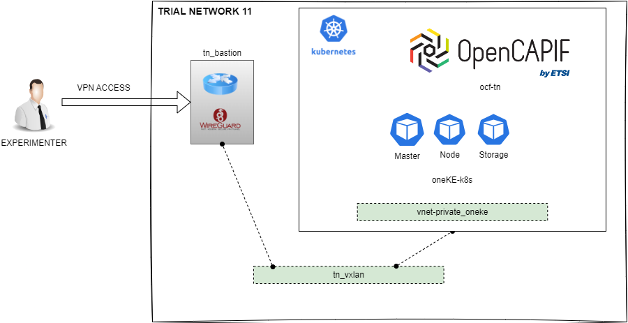
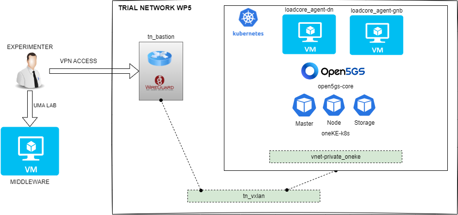

# TRIAL NETWORKS

## [Descriptor 1](./01_descriptor.yaml)

### Components

* tn_vxlan

### Platforms

* uma
* athens
* berlin
* oulu

## [Descriptor 2](./02_descriptor.yaml)

### Components

* tn_vxlan
* tn_bastion

### Platforms

* uma
* athens
* berlin
* oulu

## [Descriptor 3](./03_descriptor.yaml)

### Components

* tn_init

### Platforms

* uma
* athens
* berlin
* oulu

## [Descriptor 4](./04_descriptor.yaml)

### Components

* tn_init
* vm_kvm

### Platforms

* uma
* athens
* berlin
* oulu

## [Descriptor 5](./05_descriptor.yaml)

### Components

* tn_init
* vnet
* oneKE

### Platforms

* uma
* athens
* berlin
* oulu

## [Descriptor 6](./06_descriptor.yaml)

### Components

* tn_init
* vnet
* oneKE
* open5gs

### Platforms

* uma
* athens
* berlin
* oulu

## [Descriptor 7](./07_descriptor.yaml)

### Components

* tn_init
* vnet
* oneKE
* open5gs
* ueransim (gnb and ue separated)

### Platforms

* uma
* athens
* berlin
* oulu

## [Descriptor 8](./08_descriptor.yaml)

### Components

* tn_init
* vnet
* oneKE
* open5gs
* ueransim (all in one)

### Platforms

* uma
* athens
* berlin
* oulu

## [Descriptor 9](./09_descriptor.yaml)

### Components

* tn_init
* tsn

### Platforms

* uma

## [Descriptor 10](./10_descriptor.yaml)

### Components

* tn_init
* vnet
* oneKE
* open5gs
* nokia_radio
* stf_ue

### Platforms

* uma

## [Descriptor 11](./11_descriptor.yaml)

### Components

* tn_init
* vnet
* oneKE
* ocf (OpenCAPIF)

### Platforms

* uma
* athens
* berlin
* oulu

## [Descriptor 12](./12_descriptor.yaml)

### Components

* tn_init
* elcm

### Platforms

* uma
* athens
* berlin
* oulu

## [Descriptor WP5 - REFERENCE TN](./reference_tn.yaml)

> [!NOTE]  
> There is a [provisional descriptor](./reference_tn_provisional.yaml) for the reference TN because of a bug deploying VMs with many network interfaces into the same virtual network. 

### Components

* tn_init
* vnet
* oneKE
* open5gs
* loadcore_agent

### Platforms

* uma
* athens
* berlin
* oulu
